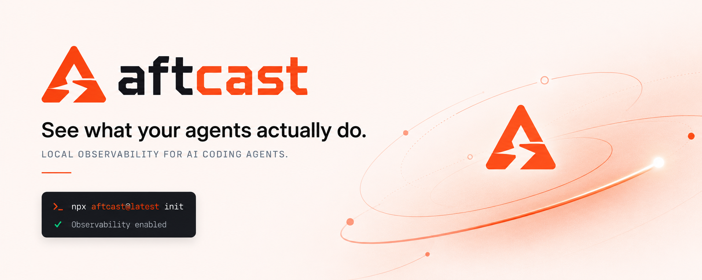

<div align="center">



[](https://www.npmjs.com/package/aftcast)
[](https://www.npmjs.com/package/aftcast)
[](https://github.com/Hypership-Software/aftcast)
[](LICENSE)

```bash
npx aftcast@latest init
```

Works with **Claude Code** today. Windows, macOS, and Linux.

</div>

---

Aftcast watches Claude Code's tool calls, records a tamper-evident metadata
trail, and turns that trail into a project-first view of what shipped, how
long the work took, what changed, where the agent needed recovery, and what
keeps failing often enough to deserve a permanent fix.

Aftcast observes; it never blocks a tool call. Prompts and file contents are
not persisted. The local record contains operational metadata such as timings,
repository-relative paths, invoked skills, risk classifications, and numeric
line-change counts.

## Install

macOS / Linux:

```bash
curl -fsSL https://raw.githubusercontent.com/Hypership-Software/aftcast/main/install.sh | sh
```

Windows (PowerShell):

```powershell
irm https://raw.githubusercontent.com/Hypership-Software/aftcast/main/install.ps1 | iex
```

Or with npm — if you run Claude Code, you already have it:

```bash
npx aftcast@latest init
```

Every path does the same thing: it fetches the [latest release](https://github.com/Hypership-Software/aftcast/releases)
binary for your platform, verifies it, and runs `aftcast init` — which
installs to `~/.aftcast/bin`, adds that to PATH, starts the daemon, and wires
the Claude Code hooks. `init` prints each action it takes and verifies the
local hook endpoint.

To pin a release instead of latest:

```bash
curl -fsSL https://raw.githubusercontent.com/Hypership-Software/aftcast/main/install.sh | AFTCAST_VERSION=v0.1.0 sh
```

Open a new terminal after it finishes (or reload your shell), then verify:

```bash
aftcast status
aftcast doctor
```

`status` should report a running daemon and wired Claude Code hooks. Every check
in `doctor` should report `ok`.

Start a new Claude Code session after installation so it loads the hooks —
Aftcast observes sessions from that point forward.

## Commands

| Command | What it does |
|---|---|
| `aftcast init` | One-time setup: install the binary, add it to PATH, start the daemon, wire the Claude Code hooks |
| `aftcast` | Open the current repository's workspace — sessions, outcomes, work mix, friction |
| `aftcast insights --all` | Browse every observed repository |
| `aftcast coach` | What keeps failing across your sessions often enough to deserve a permanent fix |
| `aftcast coach export <id>` | Plain-English evidence bundle for one recurring failure — hand it to your agent to encode a fix |
| `aftcast handoff [ref]` | Digest skeleton for a branch or commit: how the change came to exist, with a verifiable attestation |
| `aftcast status` | Daemon and hook health at a glance |
| `aftcast doctor` | Detailed wiring checks |
| `aftcast stop` | Stop the background daemon |
| `aftcast uninstall` | Remove the hooks and PATH entry, stop the daemon — your local history stays |
| `aftcast daemon run` | Run the daemon in the foreground |
| `aftcast version` | Print the version |

## What `aftcast init` changes

All changes are local and reversible:

- copies the running binary to `~/.aftcast/bin/aftcast` and adds that directory to
  PATH using a marked block in your shell profile;
- starts the Aftcast daemon in the background on localhost;
- merges Aftcast hooks into `~/.claude/settings.json` without removing your
  other settings or hooks, backing the file up first;
- stores the local audit log, policies, daemon state, and logs under `~/.aftcast`.

`aftcast uninstall` stops the daemon and removes the hooks and PATH block. It
leaves `~/.aftcast` in place so uninstalling never silently destroys your local
audit history.

## What Aftcast records — and what it never records

Recorded (metadata only, local only): timings, tool classes, risk
classifications, repository-relative paths, command verbs and exit codes,
invoked skills, and numeric line-change counts.

Never recorded: prompts, file contents, command text, code, or credentials.
Nothing is exported and nothing phones home; the record lives entirely in
`~/.aftcast` on your machine.

## Where the data lives

Everything Aftcast stores is a plain file under `~/.aftcast` — there is no
database server:

| Path | What it is |
|---|---|
| `log/events.jsonl` | The record itself — append-only JSON Lines, one metadata event per line. Each line is HMAC-chained to the one before it, so any edit, deletion, or reorder is detectable. This is the single source of truth. |
| `log/checkpoints.jsonl` | Periodic anchors of the hash chain (every 100 events). |
| `audit.key` | The local key the chain is computed with. |
| `spool/` | Short-lived buffer for hook events that arrive while the daemon is down; drained into the log when it starts. |
| `policies/` | Risk-classification policy files; the built-in starter set ships embedded in the binary, this is where yours go. |
| `bin/`, `daemon.json`, `daemon.log` | The installed binary and daemon state. |

Is it a database? Not on disk. Aftcast uses embedded SQLite (pure Go, no
server) as a read model, but only in memory: every `aftcast` launch rebuilds
it fresh from the log, so there is no database file to manage, migrate, or
corrupt. The JSONL log is the whole record — inspect it with any text tool,
back it up by copying the directory.

## Install from source

If there is no release binary for your platform (or you prefer to build your
own), you need Git, Go 1.25+, and Claude Code:

```bash
git clone https://github.com/Hypership-Software/aftcast.git
cd aftcast/core
CGO_ENABLED=0 go build -trimpath -o aftcast ./cmd/aftcast
./aftcast init
```

`init` copies the binary into `~/.aftcast/bin`, so the build artifact can be
deleted afterwards.

## About this repository

This is the open-source core of Aftcast (Apache-2.0), mirrored from a private
monorepo where development happens. `core/` is the Go binary — adapters, audit
log, telemetry read-model, analytics, and the terminal UI; `packages/npm/` is
the npm distribution. History is mirrored; issues are welcome here.

## Development

```bash
cd core
go build ./...
go test ./...
go vet ./...
```

The binary is CGO-free and cross-compiles for Windows, Linux, and macOS. SQLite
uses the pure-Go `modernc.org/sqlite` driver.

## Star History

[](https://www.star-history.com/?repos=Hypership-Software%2Faftcast&type=date&legend=top-left)

## License

Apache-2.0 © 2026 [Hypership Ltd](https://hypership.tech). See [LICENSE](LICENSE) and [NOTICE](NOTICE).
